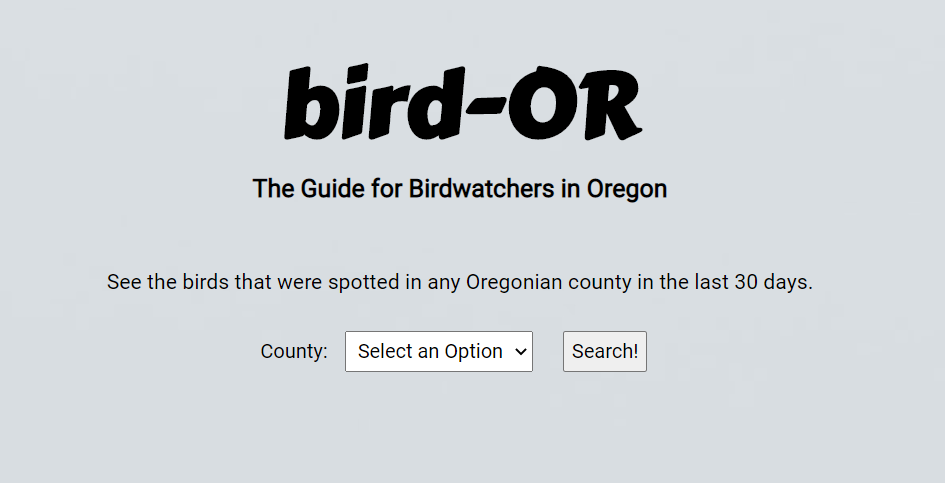
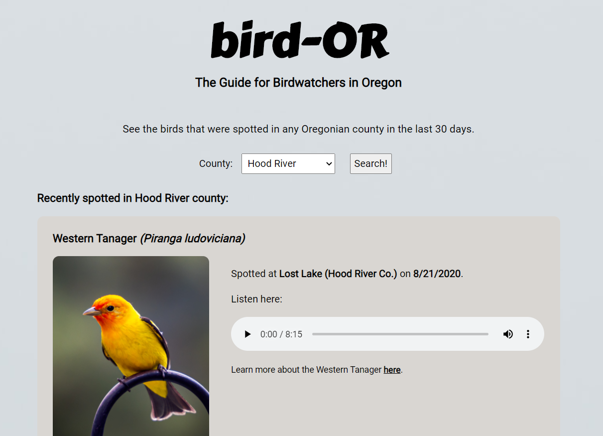
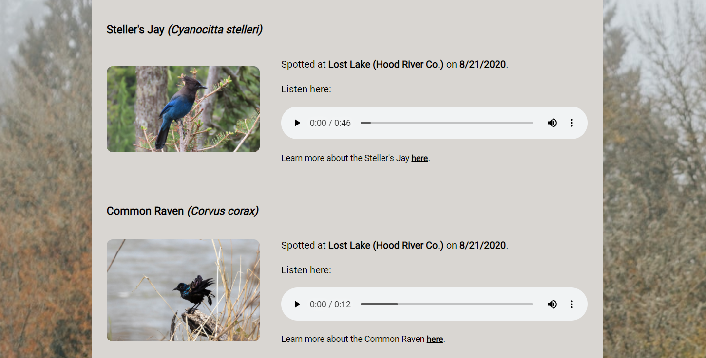

# bird-OR
An application for birdwatchers located in Oregon. The user can search any county in Oregon and see birds that have been spotted there over the last 30 days. 

## Link
https://sallygaller.github.io/bird-OR/

## About 
bird-OR was designed with novice birdwatchers in mind: they want to broaden their knowledge of different bird species located in their county, and they want to know what to look and listen for when they go birdwatching. So much of birdwatching is actually “bird-listening” - i.e. birdwatchers often hear more birds than they see. By providing both snippets of the bird’s song and a picture of the bird, the user has a higher chance of identifying unfamiliar birds in their region and remembering them.   

## How to Use
The user begins by selecting a county in Oregon. They are provided with a list of birds that have been spotted in the county within the last 30 days.
For each bird, the user sees its common and scientific name, and when and where the bird was seen. An image of the bird and an audio file of its birdsong is also included. 
To learn more about a specific bird, the user may click a link to the e-bird article for the bird’s species.  

## Built With
HTML, CSS, JavaScript, and jQuery. APIs used: e-bird, Flickr, and freesound. 

## Screenshots
Home page:

Results page:

